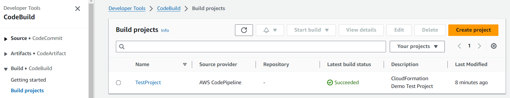
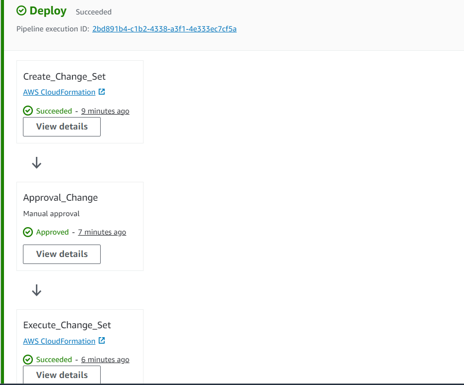
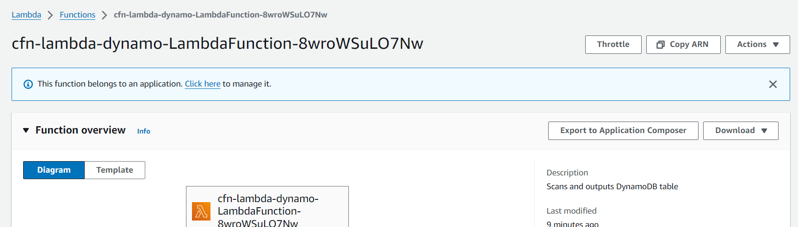

**The requirements**

Create cloud formaton templates for provisioning the below resources

1) (VPC1) VPC with 2 private and public subnets. Please ensure that in the CFN you are
   parameterizing and exporting values such as vpcid, vpc cidr, subnetids, subnet cidrs
2) Using the same template, provision another vpc (vpc 2) with private subnet
3) Deploy an aws client vpn in the vpc using CFN template
4) Deploy a psql serverless db in the second vpc.
5) Create peering between vpc 1, and vpc2, add the necessary target associa.ons and
   authoriza.ons in the vpn client

**Part A**
i) Create an APIGateway using AWS::Serverless::Api in vpc1
ii) Create another CFN template which will deploy a simple healthcheck api in lambda and add a route with the private apigateway created above. Please use ApiGatewayV2 for the integration.
iii) Create a codepipeline that will perform CI/CD of the code created as part of 3.
a. This expects source to be github , perform the codebuild, and deploy the lambda via CFN

**Part B**
i) Connect to the RDS created in Step 5 from your desktop without ssh tunneling, but by using vpn.

**In Completed sections****

1. Deploy an aws client vpn in the vpc using CFN template
2. Connect to the RDS created in Step 5 from your desktop without ssh tunneling, but by using vpn.
3. Has not added Elastic IP's to create NAT Gateway for private out traffic

**Folder Structure**

1. APIGW-Lambda : This folder contains the cloudformation template to create the API gateway which integrates with a Lambda pertaining to Part A i) and ii)
2. CICD : This folder contains the CICD pipeline cloudformation script to create and deploy a Lambda using code pipeline pertaining to Part A iii)
3. PSQL : This folder contains the cloudformation template to deploy a PSQL RDS pertaining to 4)
4. VPC-Subnets : This folder contains the cloudformation scripts to deploy VPC and peering connection pertaining to 1,2 and 5

**Installation**

Start with creating the VPC1 and VPC2 using the cloudformation script using the same template. Execute the **CreateVPCs.bat** file inside folder VPC-Subnets. This batch files use **VPC-Dynamic.yaml** to create VPC and Subnets based on the parameter file.

**VPC1 **: aws cloudformation create-stack --stack-name VPC1 --template-body file://VPC-Dynamic.yaml --parameters file://parameters/parameters-2pub-2priv.json --capabilities CAPABILITY_AUTO_EXPAND

**VPC2** : aws cloudformation create-stack --stack-name VPC2 --template-body file://VPC-Dynamic.yaml --parameters file://parameters/parameters-0pub-1priv.json --capabilities CAPABILITY_AUTO_EXPAND

This stack exports VPCID, VPC-CIDR, Subnet ID's, Subnet ID CIDRs which will be imported into other stacks.

Create the psql rds using cloudformation script present in PSQL folder. Run the "CreatePSQL.bat" to deplo the PSQL which runs the command as below

PSQL : aws cloudformation create-stack --stack-name PSQL --template-body file://rds.yaml

Create API Gateway by using the cloudformation script inside APIGW-Lambda folder. Run the command CreateAPIGateway.bat to create API gateway and Lambda function

APIGateway : aws cloudformation create-stack --stack-name APIGW-Lambda --template-body file://api-gw.yaml --capabilities CAPABILITY_IAM

Code Pipeline : Code build and Code pipeline deployment using CLoudformation. Run the bat file CreateRoleandCode.bat followed by CreateMasterBranch.bat to deploy the stack. It also deploys a Lambda using CLoudformation within the pipeline with Manual approval stage for the code deployment.

**Best Practices**

Used Same VPC template to create multiple VPC-Subnets by parameterizing and using Cloud formation Intrinsic function.

Used Stack import to reference the exported resources created by other stacks.

Added the NACL to Subnets based on public and private traffic control

Dynamic tagging of resource names to clearly identify the resources

Used AWS::ApiGatewayV2::Integration for Integrating Lambda with API gateway

Dynamic creation of IAM roles based on Least previleges.

Used AWS SecretsManager to store the PSQL credentials

**Screenshot references**

Output

